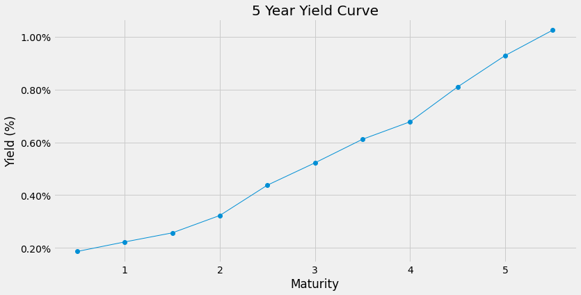
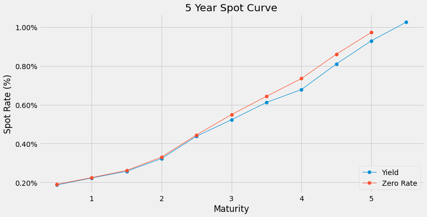
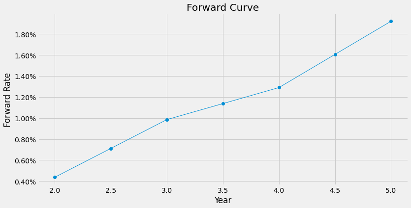

# Canadian Treasury Analysis

Check out the Analysis [[Notebook]](https://nbviewer.jupyter.org/github/SebastianLech/treasury_analysis/blob/main/treasury_analysis_nb.ipynb)

Results:

```markdown
| time |    Yield |     Spot |  forward |
|-----:|---------:|---------:|---------:|
|  0.5 | 0.001869 | 0.001901 |      NaN |
|  1.0 | 0.002229 | 0.002248 |      NaN |
|  1.5 | 0.002573 | 0.002616 |      NaN |
|  2.0 | 0.003232 | 0.003307 | 0.004365 |
|  2.5 | 0.004379 | 0.004446 | 0.007111 |
|  3.0 | 0.005223 | 0.005490 | 0.009856 |
|  3.5 | 0.006115 | 0.006430 | 0.011381 |
|  4.0 | 0.006777 | 0.007344 | 0.012906 |
|  4.5 | 0.008097 | 0.008596 | 0.016064 |
|  5.0 | 0.009285 | 0.009719 | 0.019221 |
```







